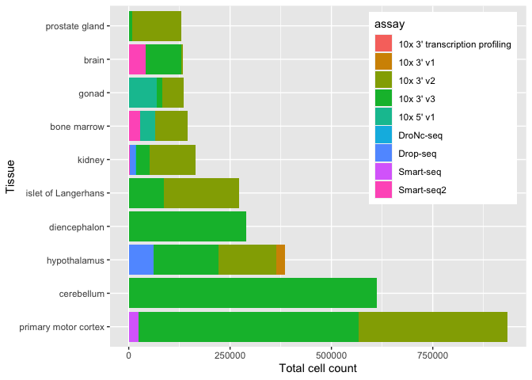
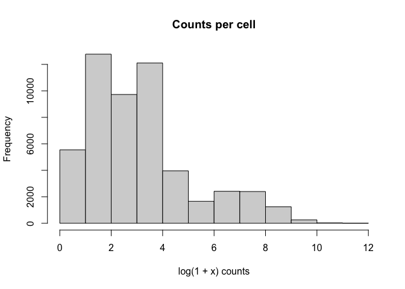

<!-- README.md is generated from README.Rmd. Please edit that file -->

# CxGcensus

<!-- badges: start -->
<!-- badges: end -->

CxGcensus is an alternative *R* client to the [CELLxGENE
census](https://chanzuckerberg.github.io/cellxgene-census/). It
emaphsizes use cases related to data discovery, and uses in-memory and
on-disk caches to reduce latency associated with repeated queries.

## Installation

Install CxGcensus from [GitHub](https://github.com/) with:

``` r
## install.packages("devtools")
devtools::install_github("mtmorgan/CxGcensus")
```

## Data exploration

Load the package

``` r
library(CxGcensus)
```

Discover datasets used to construct the census

``` r
datasets()
#> # A tibble: 562 × 8
#>    soma_joinid collection_id           collection_name collection_doi dataset_id
#>          <int> <chr>                   <chr>           <chr>          <chr>     
#>  1           0 6b701826-37bb-4356-979… Abdominal Whit… <NA>           9d8e5dca-…
#>  2           1 4195ab4c-20bd-4cd3-8b3… A spatially re… <NA>           a6388a6f-…
#>  3           2 4195ab4c-20bd-4cd3-8b3… A spatially re… <NA>           842c6f5d-…
#>  4           3 4195ab4c-20bd-4cd3-8b3… A spatially re… <NA>           74520626-…
#>  5           4 4195ab4c-20bd-4cd3-8b3… A spatially re… <NA>           396a9124-…
#>  6           5 74e10dc4-cbb2-4605-a18… Spatial proteo… 10.1016/j.cel… e84f2780-…
#>  7           6 74e10dc4-cbb2-4605-a18… Spatial proteo… 10.1016/j.cel… dfdf1ae2-…
#>  8           7 74e10dc4-cbb2-4605-a18… Spatial proteo… 10.1016/j.cel… d1cbed97-…
#>  9           8 74e10dc4-cbb2-4605-a18… Spatial proteo… 10.1016/j.cel… b03e4ef8-…
#> 10           9 6d203948-a779-4b69-9b3… Differential c… 10.1016/j.cel… f1f123cc-…
#> # ℹ 552 more rows
#> # ℹ 3 more variables: dataset_title <chr>, dataset_h5ad_path <chr>,
#> #   dataset_total_cell_count <int>
```

`dataset_id` and `collection_id` can be used in the
[cellxgenedp](https://bioconductor.org/packages/cellxgenedp) package for
programmatic retrieval and visualization of individual datasets.

The organisms present in the census (use these in calls to
`feature_data()` or `observation_data()`) are available with

``` r
census_names()
#> [1] "homo_sapiens" "mus_musculus"
```

Summarize information about cells in the census

``` r
summary_cell_counts() |>
    filter(category == "sex") |>
    select(
        organism, label,
        unique_cell_count, total_cell_count
    )
#> # A tibble: 6 × 4
#>   organism     label   unique_cell_count total_cell_count
#>   <chr>        <chr>               <int>            <int>
#> 1 Homo sapiens female           14516846         22513226
#> 2 Homo sapiens male             17097019         28197731
#> 3 Homo sapiens unknown           2145022          3083771
#> 4 Mus musculus female            1066585          1431227
#> 5 Mus musculus male              1655113          2462185
#> 6 Mus musculus unknown            192620           192620
```

Learn about features (genes) in, e.g., `homo_sapiens` datasets in the
census

``` r
feature_data("mus_musculus")
#> # A tibble: 52,392 × 4
#>    soma_joinid feature_id         feature_name  feature_length
#>          <int> <chr>              <chr>                  <int>
#>  1           0 ENSMUSG00000109644 0610005C13Rik           3583
#>  2           1 ENSMUSG00000108652 0610006L08Rik           2128
#>  3           2 ENSMUSG00000007777 0610009B22Rik            998
#>  4           3 ENSMUSG00000086714 0610009E02Rik           1803
#>  5           4 ENSMUSG00000043644 0610009L18Rik            619
#>  6           5 ENSMUSG00000042208 0610010F05Rik           5226
#>  7           6 ENSMUSG00000020831 0610010K14Rik           1896
#>  8           7 ENSMUSG00000089755 0610012D04Rik            531
#>  9           8 ENSMUSG00000107002 0610012G03Rik           1445
#> 10           9 ENSMUSG00000046683 0610025J13Rik           1121
#> # ℹ 52,382 more rows
```

Observation (cell) data annotations are available with
`observation_data()`. The strategy adopted is to download all the data
to a local [duckdb](https://cran.r-project.org/package=duckdb) database.
Download can be time-consuming, but the results are ‘memoised’ so
subsequent calls are more-or-less instantaneous.

``` r
mus <- observation_data("mus_musculus")
mus
#> # Source:   table<obs> [?? x 21]
#> # Database: DuckDB 0.8.1 [root@Darwin 21.6.0:R 4.3.0//Users/ma38727/Library/Caches/org.R-project.R/R/CxGcensus/39d32a8aa140.duckdb]
#>    soma_joinid dataset_id                 assay assay_ontology_term_id cell_type
#>          <int> <chr>                      <chr> <chr>                  <chr>    
#>  1           0 be46dfdc-0f99-4731-8957-6… 10x … EFO:0011025            mesenchy…
#>  2           1 be46dfdc-0f99-4731-8957-6… 10x … EFO:0011025            mesenchy…
#>  3           2 be46dfdc-0f99-4731-8957-6… 10x … EFO:0011025            mesothel…
#>  4           3 be46dfdc-0f99-4731-8957-6… 10x … EFO:0011025            mesenchy…
#>  5           4 be46dfdc-0f99-4731-8957-6… 10x … EFO:0011025            mesenchy…
#>  6           5 be46dfdc-0f99-4731-8957-6… 10x … EFO:0011025            intersti…
#>  7           6 be46dfdc-0f99-4731-8957-6… 10x … EFO:0011025            mesenchy…
#>  8           7 be46dfdc-0f99-4731-8957-6… 10x … EFO:0011025            mesenchy…
#>  9           8 be46dfdc-0f99-4731-8957-6… 10x … EFO:0011025            Sertoli …
#> 10           9 be46dfdc-0f99-4731-8957-6… 10x … EFO:0011025            mesenchy…
#> # ℹ more rows
#> # ℹ 16 more variables: cell_type_ontology_term_id <chr>,
#> #   development_stage <chr>, development_stage_ontology_term_id <chr>,
#> #   disease <chr>, disease_ontology_term_id <chr>, donor_id <chr>,
#> #   is_primary_data <lgl>, self_reported_ethnicity <chr>,
#> #   self_reported_ethnicity_ontology_term_id <chr>, sex <chr>,
#> #   sex_ontology_term_id <chr>, suspension_type <chr>, tissue <chr>, …
```

The columns available for cross-dataset analysis are

``` r
mus |>
    colnames()
#>  [1] "soma_joinid"                             
#>  [2] "dataset_id"                              
#>  [3] "assay"                                   
#>  [4] "assay_ontology_term_id"                  
#>  [5] "cell_type"                               
#>  [6] "cell_type_ontology_term_id"              
#>  [7] "development_stage"                       
#>  [8] "development_stage_ontology_term_id"      
#>  [9] "disease"                                 
#> [10] "disease_ontology_term_id"                
#> [11] "donor_id"                                
#> [12] "is_primary_data"                         
#> [13] "self_reported_ethnicity"                 
#> [14] "self_reported_ethnicity_ontology_term_id"
#> [15] "sex"                                     
#> [16] "sex_ontology_term_id"                    
#> [17] "suspension_type"                         
#> [18] "tissue"                                  
#> [19] "tissue_ontology_term_id"                 
#> [20] "tissue_general"                          
#> [21] "tissue_general_ontology_term_id"
```

It is straight-forward to summarize or query the data, e.g., for the
number of different types of assays represented, or for studies of
diabetes.

``` r
mus |>
    count(assay, sort = TRUE)
#> # Source:     SQL [9 x 2]
#> # Database:   DuckDB 0.8.1 [root@Darwin 21.6.0:R 4.3.0//Users/ma38727/Library/Caches/org.R-project.R/R/CxGcensus/39d32a8aa140.duckdb]
#> # Ordered by: desc(n)
#>   assay                                n
#>   <chr>                            <dbl>
#> 1 10x 3' v3                      1925688
#> 2 10x 3' v2                      1622998
#> 3 Smart-seq2                      221648
#> 4 10x 5' v1                       161525
#> 5 Drop-seq                         80990
#> 6 Smart-seq                        48972
#> 7 10x 3' v1                        21421
#> 8 DroNc-seq                         2768
#> 9 10x 3' transcription profiling      22
mus |>
    filter(grepl("diabetes", disease)) |>
    count(disease, sex, tissue)
#> # Source:   SQL [2 x 4]
#> # Database: DuckDB 0.8.1 [root@Darwin 21.6.0:R 4.3.0//Users/ma38727/Library/Caches/org.R-project.R/R/CxGcensus/39d32a8aa140.duckdb]
#>   disease                  sex    tissue                  n
#>   <chr>                    <chr>  <chr>               <dbl>
#> 1 type 1 diabetes mellitus female islet of Langerhans 39932
#> 2 type 2 diabetes mellitus male   islet of Langerhans 99747
```

Use [ggplot2](https://cran.r-project.org/package=ggplot2) to visualize
tissue type and assay.

``` r
library(ggplot2)

## 10 most-common tissues; total cell count
common_tissues <-
    mus |>
    count(tissue, sort = TRUE) |>
    head(10) |>
    collect() |>
    pull(tissue)
## assays on each tissue
tissue_and_assay <-
    mus |>
    filter(tissue %in% common_tissues) |>
    count(tissue, assay, sort = TRUE) |>
    collect()
## visualize
ggplot(tissue_and_assay) +
    aes(x = factor(tissue, levels = common_tissues), y = n, fill = assay) +
    geom_bar(position="stack", stat="identity") +
    labs(x = "Tissue", y = "Total cell count") +
    coord_flip() +
    theme(legend.position = c(.8, .7))
```



The `soma_joinid` in the tibbles returned by `feature_data()` and
`observation_data()` are important in retrieving counts.

## SingleCellExperiment

To create a Bioconductor
[SingleCellExperiment](https://bioconductor.org/packages/SingleCellExperiment),
perhaps for use in one of the [Orchestrating Single Cell Analysis with
Bioconductor](https://bioconductor.org/books/OSCA) (OSCA) workflows,
first select desired features and observations. For illustration we
choose 100 random genes

``` r
set.seed(12)
features <- feature_data("mus_musculus")
random_features <-
    features |>
    slice(sample(nrow(features), 100))
```

and choose all cells from brain tissue and development stage 20 month
old or latter.

``` r
observations <- observation_data("mus_musculus")
brain_20mo <-
    observations |>
    filter(
        tissue == "brain",
        development_stage == "20 month-old stage and over"
    ) |>
    collect()
```

Cells are from several datasets

``` r
brain_20mo |>
    count()
#> # A tibble: 1 × 1
#>       n
#>   <int>
#> 1 52132
brain_20mo |>
    count(dataset_id)
#> # A tibble: 5 × 2
#>   dataset_id                               n
#>   <chr>                                <int>
#> 1 3bbb6cf9-72b9-41be-b568-656de6eb18b5 38695
#> 2 58b01044-c5e5-4b0f-8a2d-6ebf951e01ff  3077
#> 3 66ff82b4-9380-469c-bc4b-cfa08eacd325   756
#> 4 98e5ea9f-16d6-47ec-a529-686e76515e39  5180
#> 5 c08f8441-4a10-4748-872a-e70c0bcccdba  4424
```

Use these to create a `SingleCellExperiment`.

``` r
sce <- single_cell_experiment("mus_musculus", random_features, brain_20mo)
sce
#> class: SingleCellExperiment 
#> dim: 100 52132 
#> metadata(1): census_metadata
#> assays(1): counts
#> rownames: NULL
#> rowData names(4): soma_joinid feature_id feature_name feature_length
#> colnames: NULL
#> colData names(21): soma_joinid dataset_id ... tissue_general
#>   tissue_general_ontology_term_id
#> reducedDimNames(0):
#> mainExpName: NULL
#> altExpNames(0):
```

The experiment has `counts()` as a sparse (`dgCMatrix`, from the Matrix
package) matrix, with `features` and `observations` available (as
*Bioconductor* `DataFrame` objects, rather than tibbles) via `rowData()`
and `colData()`. The data is straight-forward to work with, e.g.,
removing features for which no counts were observed…

``` r
library(SingleCellExperiment)
keep_rows <- Matrix::rowSums(counts(sce, withDimnames = FALSE)) != 0
table(keep_rows)
#> keep_rows
#> FALSE  TRUE 
#>    56    44
sce[keep_rows,]
#> class: SingleCellExperiment 
#> dim: 44 52132 
#> metadata(1): census_metadata
#> assays(1): counts
#> rownames: NULL
#> rowData names(4): soma_joinid feature_id feature_name feature_length
#> colnames: NULL
#> colData names(21): soma_joinid dataset_id ... tissue_general
#>   tissue_general_ontology_term_id
#> reducedDimNames(0):
#> mainExpName: NULL
#> altExpNames(0):
```

… or summarizing the total number of reads observed in each cell

``` r
hist(
    log1p(colSums(counts(sce, withDimnames = FALSE))),
    main = "Counts per cell",
    xlab = "log(1 + x) counts",
)
```



## Session information

This README was compiled with CxGcensus version 0.0.0.9009. Full session
info is:

``` r
sessionInfo()
#> R version 4.3.0 Patched (2023-05-01 r84362)
#> Platform: aarch64-apple-darwin21.6.0 (64-bit)
#> Running under: macOS Monterey 12.6.6
#> 
#> Matrix products: default
#> BLAS:   /Users/ma38727/bin/R-4-3-branch/lib/libRblas.dylib 
#> LAPACK: /Users/ma38727/bin/R-4-3-branch/lib/libRlapack.dylib;  LAPACK version 3.11.0
#> 
#> locale:
#> [1] en_US.UTF-8/en_US.UTF-8/en_US.UTF-8/C/en_US.UTF-8/en_US.UTF-8
#> 
#> time zone: America/New_York
#> tzcode source: internal
#> 
#> attached base packages:
#> [1] stats4    stats     graphics  grDevices utils     datasets  methods  
#> [8] base     
#> 
#> other attached packages:
#>  [1] SingleCellExperiment_1.23.0 SummarizedExperiment_1.31.1
#>  [3] Biobase_2.61.0              GenomicRanges_1.53.1       
#>  [5] GenomeInfoDb_1.37.1         IRanges_2.35.1             
#>  [7] S4Vectors_0.39.1            BiocGenerics_0.47.0        
#>  [9] MatrixGenerics_1.13.0       matrixStats_1.0.0          
#> [11] ggplot2_3.4.2               CxGcensus_0.0.0.9009       
#> [13] RcppSpdlog_0.0.13           dplyr_1.1.2                
#> 
#> loaded via a namespace (and not attached):
#>  [1] tidyselect_1.2.0            farver_2.1.1               
#>  [3] blob_1.2.4                  urltools_1.7.3             
#>  [5] arrow_12.0.1                bitops_1.0-7               
#>  [7] fastmap_1.1.1               RCurl_1.98-1.12            
#>  [9] duckdb_0.8.1                digest_0.6.31              
#> [11] lifecycle_1.0.3             magrittr_2.0.3             
#> [13] compiler_4.3.0              rlang_1.1.1                
#> [15] tools_4.3.0                 utf8_1.2.3                 
#> [17] yaml_2.3.7                  data.table_1.14.8          
#> [19] knitr_1.43                  S4Arrays_1.1.4             
#> [21] labeling_0.4.2              bit_4.0.5                  
#> [23] spdl_0.0.5                  curl_5.0.1                 
#> [25] DelayedArray_0.27.5         aws.signature_0.6.0        
#> [27] xml2_1.3.4                  withr_2.5.0                
#> [29] purrr_1.0.1                 triebeard_0.4.1            
#> [31] grid_4.3.0                  fansi_1.0.4                
#> [33] colorspace_2.1-0            scales_1.2.1               
#> [35] cli_3.6.1                   crayon_1.5.2               
#> [37] rmarkdown_2.22              generics_0.1.3             
#> [39] tiledbsoma_0.0.0.9028       httr_1.4.6                 
#> [41] DBI_1.1.3                   cachem_1.0.8               
#> [43] zlibbioc_1.47.0             assertthat_0.2.1           
#> [45] XVector_0.41.1              base64enc_0.1-3            
#> [47] vctrs_0.6.3                 Matrix_1.5-4.1             
#> [49] jsonlite_1.8.5              bit64_4.0.5                
#> [51] glue_1.6.2                  gtable_0.3.3               
#> [53] aws.s3_0.3.21               munsell_0.5.0              
#> [55] nanotime_0.3.7              tibble_3.2.1               
#> [57] pillar_1.9.0                htmltools_0.5.5            
#> [59] GenomeInfoDbData_1.2.10     R6_2.5.1                   
#> [61] dbplyr_2.3.2                evaluate_0.21              
#> [63] lattice_0.21-8              RcppCCTZ_0.2.12            
#> [65] highr_0.10                  cellxgene.census_0.0.0.9000
#> [67] memoise_2.0.1               tiledb_0.19.1.8            
#> [69] Rcpp_1.0.10                 SparseArray_1.1.10         
#> [71] xfun_0.39                   fs_1.6.2                   
#> [73] zoo_1.8-12                  pkgconfig_2.0.3
```
